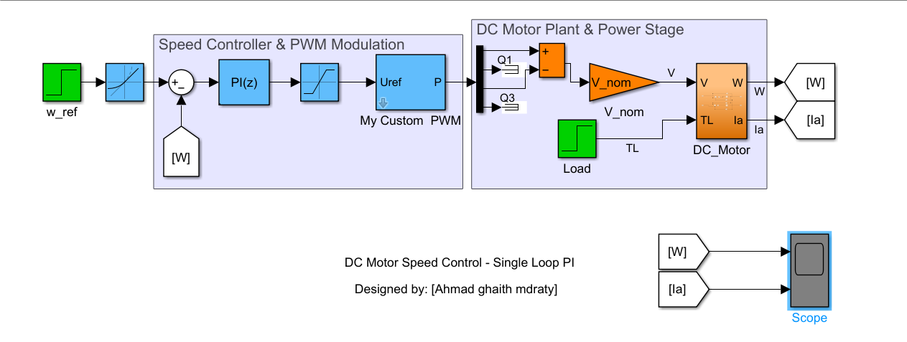
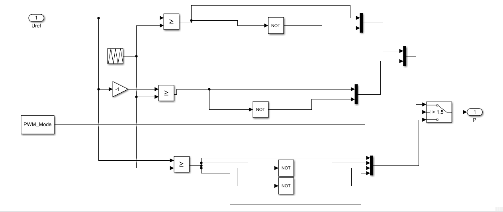
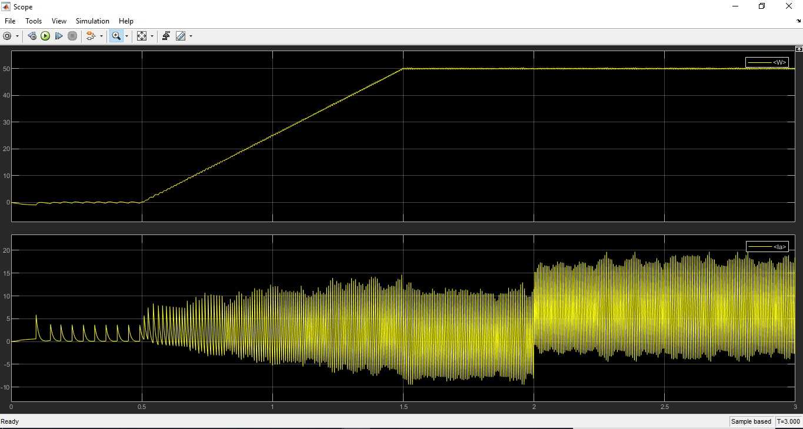

# DC Motor Speed Control - Model-Based Design (MBD) 🚀

## Overview
This repository contains a complete mathematical model for controlling the speed of a DC Motor using MATLAB/Simulink. Instead of relying on pre-built physical toolboxes (like Simscape), this project is built entirely from scratch using fundamental electrical and mechanical differential equations.

## Key Features 🛠️
* **Mathematical Plant Modeling:** The DC motor is modeled using pure mathematical blocks, highlighting a deep understanding of the system's differential equations.
* **Custom PWM Generator (Masked):** Designed a custom Unipolar/Bipolar PWM generation subsystem from the ground up. It includes a user-friendly UI (Mask) allowing seamless toggling between switching modes.
* **PI Controller Tuning:** Implemented and tuned a PI controller to ensure zero steady-state error and smooth tracking of the reference speed (50 rad/s), even under sudden mechanical load changes.
* **Hardware Logic Considerations:** Handled software-side power electronics challenges, such as resolving 'Data Type Underflow' during logical subtraction of switching states.

## System Architecture 🏗️
Below is the overall Simulink model, clearly divided into the Controller stage and the Plant/Power stage:

*(Please view the uploaded model image here)*

## Custom PWM Logic ⚙️
A look inside the custom PWM block showing the logical comparisons used to generate the switching signals without relying on standard Simulink discrete blocks:

## Simulation Results 📈
The scope below demonstrates the system's robustness:
1. **Top Graph (Speed):** The motor smoothly reaches the target speed (50 rad/s).
2. **Bottom Graph (Current):** Shows the current response. Notice the system's reaction at `t = 2.0s` when a sudden mechanical load torque is applied. The PI controller immediately adjusts the duty cycle to maintain the speed.

## How to Run 💻
1. Clone or download this repository.
2. Open the `DC_Motor_Single_PI.slx` file in MATLAB/Simulink.
3. Run the simulation and open the Scope blocks to observe the results.

---
**Designed by:** Ahmad Ghaith Mdraty  
**Role:** Mechatronics & Control Systems Engineer
